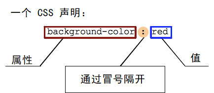

# CSS语法
```css
body{
    color:blue;
    text-decoration: underline;
}
```
- property:人类可理解的标识符，如上面的color,text-decoration
- value: 赋予property的值，比如上面的blue,underline
- CSS声明= property+ value

- 选择器（slector) 如上面的body
- selector+CSS声明，上面的整个例子成为ruleset,简称rule 
- @-rules
  - @charset,@import (meta daata)
  - @media, @document (conditional information)
  - @font-face (discritable information)
  <br>
  <br>
  具体语法例子（conditional information)
  ```css
  @media (min-width: 801px) {
  body {
    margin: 0 auto;
    width: 800px;
   }
  }
  <!-- 只有在页面宽度超过801像素的时候执行 -->
  ```
## 使CSS语法更具有可读性
- 使用空格

``` css
body {
  font: 1em/150% Helvetica, Arial, sans-serif;
  padding: 1em;
  margin: 0 auto;
  max-width: 33em;
}

@media (min-width: 70em) {
  body {
    font-size: 130%;
  }
}

h1 {
  font-size: 1.5em;
}

div p, #id:first-line {
  background-color: red;
  background-style: none
}

div p {
  margin: 0;
  padding: 1em;
}

div p + p {
  padding-top: 0;
}
/* 高可读性的例子 */
‘’‘

```css
body {font: 1em/150% Helvetica, Arial, sans-serif; padding: 1em; margin: 0 auto; max-width: 33em;}
@media (min-width: 70em) { body {font-size: 130%;} }

h1 {font-size: 1.5em;}

div p, #id:first-line {background-color: red; background-style: none}
div p {margin: 0; padding: 1em;}
div p + p {padding-top: 0;}
/* 错误的示范 */
```
但是仅限于CSS声明以外的部分,应当确保用一个空格分割不同的value
```css
margin: 0 auto;
padding-left: 10px;
/* 有效的CSS */
margin: 0auto;
padding- left: 10px;
/* 无效的CSS */
```

## 简写
- 简写属性：允许在一行设置多个属性
如 font,background,padding,border,margin
```css
/* 在padding和margin这样的简写属性中，值赋值的顺序是top、right、bottom、left。 
   它们还有其他简写方式，例如给padding两个值，则第一个值表示top/bottom，第二个值表示left/right */
padding: 10px 15px 15px 5px;
```
